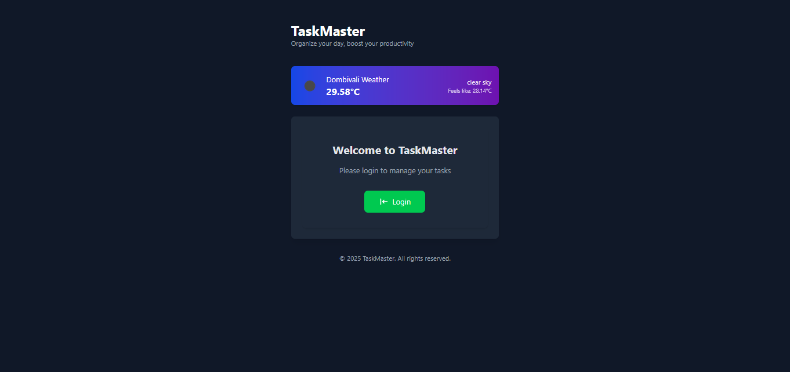
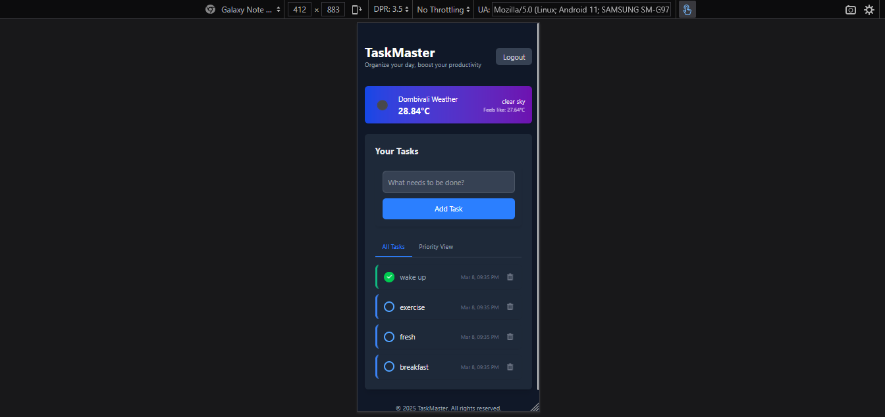
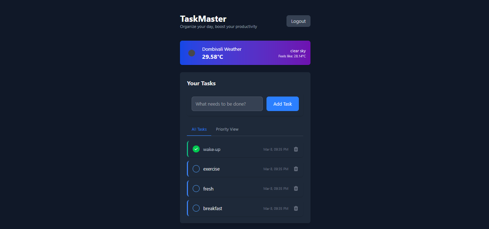
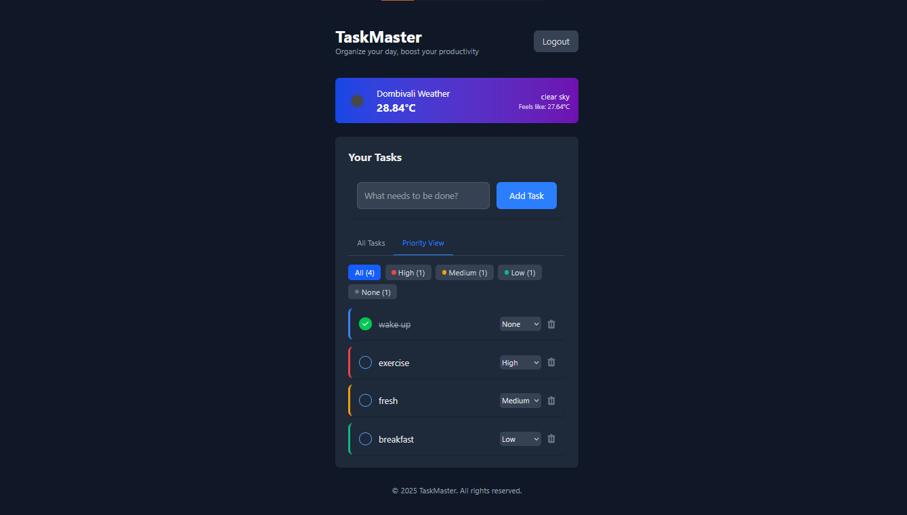
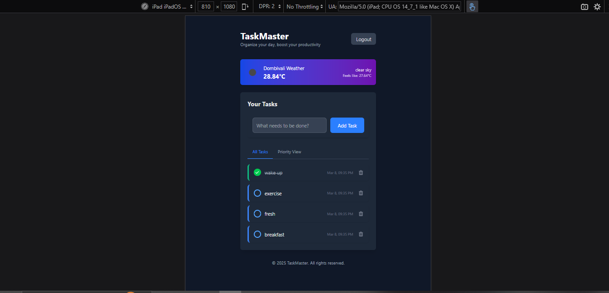

# To-Do App

A simple and intuitive To-Do App built using **React.js** and **Redux Toolkit** to manage daily tasks efficiently.

## 📜 Project Description
The To-Do App is a task management tool built using React.js and Redux Toolkit. It allows users to add, edit, delete, and mark tasks as completed. Tasks are saved in Local Storage for data persistence. The app offers a clean UI, smooth functionality, and easy task management.

## 🚀 Features
- ✅ Add new tasks
- ✅ Delete tasks
- ✅ Mark tasks as completed
- ✅ Persist tasks using Local Storage
- ✅ User authentication 

## 🛠 Tech Stack
- **React.js** - Frontend library
- **Redux Toolkit** - State management
- **Axios** - HTTP requests
- **CSS (Tailwind CSS)** - Styling
- **Local Storage** - Data persistence

## 💻 Setup Instructions

1. **Clone the Repository**

bash
git clone https://github.com/YashPalav26/TodoReact.git

2. **Navigate to the Project Directory**

bash
cd TodoReact

3. **Install Dependencies**

bash
npm install

4. **Start the Development Server**

bash
npm start

The app will run on [http://localhost:3000](http://localhost:3000).

## 📂 Project Structure

## 🗄️ State Management
The app uses **Redux Toolkit** for state management. Tasks are stored in the Redux store and persist in Local Storage.

## 📸 Screenshots
### 1. Home Page

### 2. Mobile Responsive

### 3. Add Task

### 4. Mark Task as Completed

### 5. Tablet Responsive

## 💡 Future Improvements
- 🔥 User authentication with JWT
- 📅 Task due date reminder
- 📊 Task categories and filters

## 📬 Contact
If you have any questions or suggestions, feel free to contact me at (mailto: yashpalav100@gmail.com).

---

**GitHub Repository Link:** [https://github.com/YashPalav26/TodoReact](https://github.com/YashPalav26/TodoReact)

